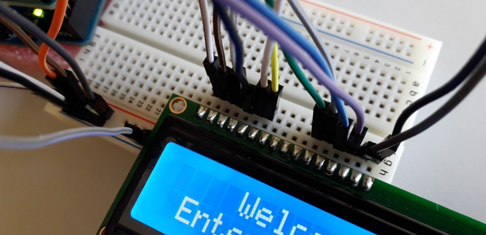
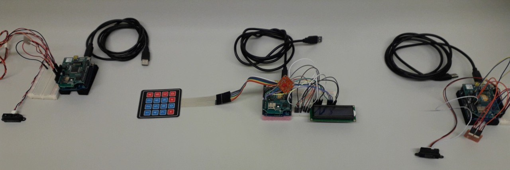
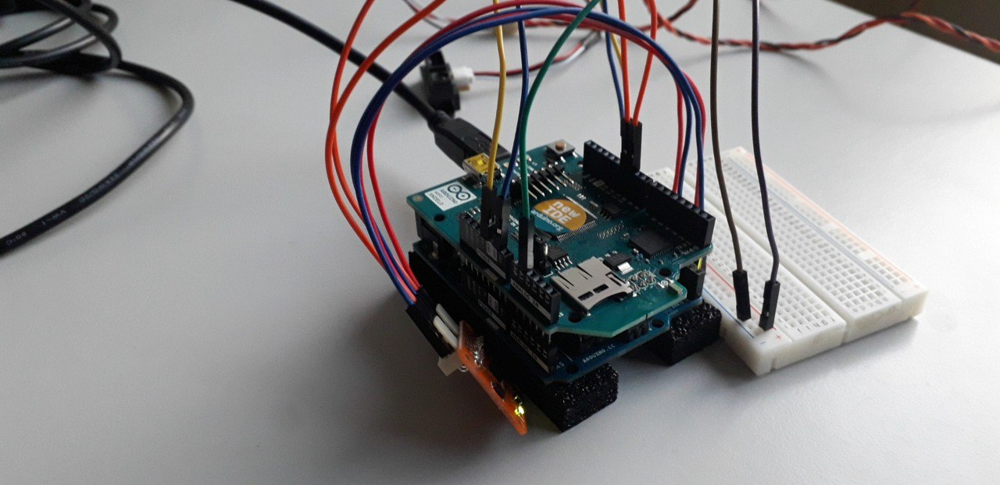
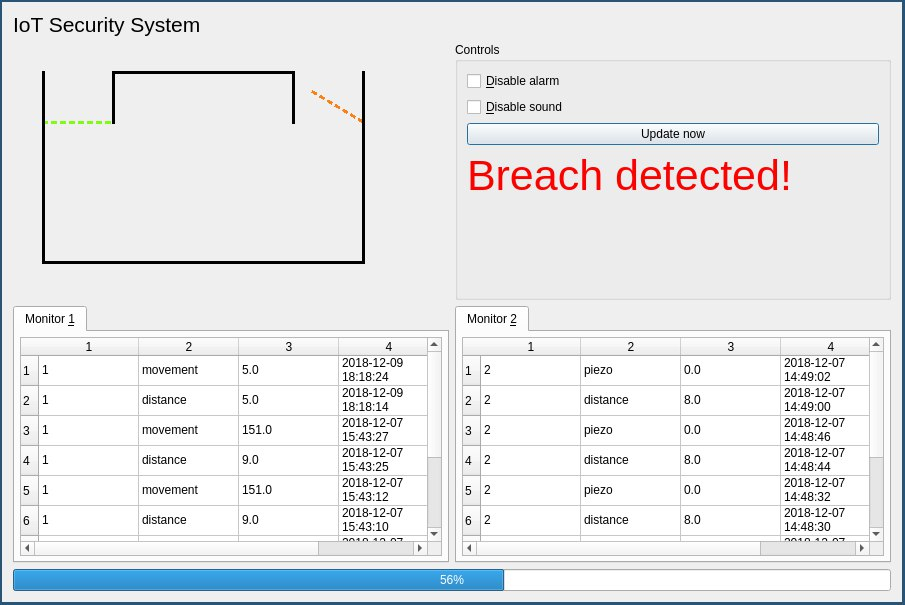

# Arduino IoT Security System

Uses multiple Arduinos equipped with WiFi shields, LCD display, keypad, LED's, infrared distance sensors, accelerometers and piezoelectric sensors to detect when doors are opened and when the equipment is interfered with. All devices can be powered via cable or battery.

A central Arduino, equipped with a keypad and a LCD display, contacts a local or remote server to enable and disable the alarm, via authentication.

The sensor devices collect information data and send it to the server at regular intervals. If the alarm is enabled it is triggered when devices stop reporting data or when the parameters reported are anomalous.

Wireless communication with HTTP SSL. Provides a basic UI via pyQT.

> Currently WIP.

Distance and piezo sensor (left), Keypad and LCD alarm control (center), Distance and accelerometer (right):

Close up of a sensor:

Close up of controller:

Proof of Concept UI:

## Create cert using
    sudo openssl req -x509 -nodes -days 365 -newkey rsa:2048 -keyout mycert.pem -out mycert.pem

